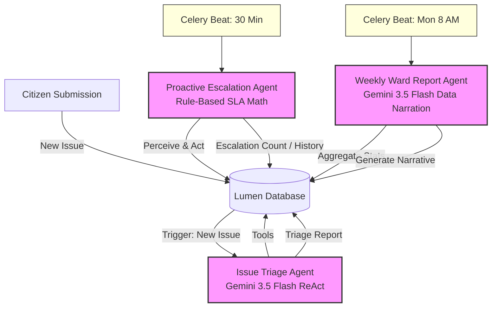

# Lumen — Agentic AI Architecture

## What Makes Lumen Agentic

A system is "agentic" when its AI components:
1. **Perceive** their environment (read structured state)
2. **Reason** about what actions to take (multi-step decision making)
3. **Act** autonomously toward a goal (without human instruction at each step)
4. **Adapt** based on observed outcomes (feedback loop)

Lumen has three purpose-built AI agents, each with distinct behavior patterns.

---

## Agent 1: Issue Triage Agent

**Trigger:** Activated automatically after every new issue submission.
**Pattern:** ReAct (Reason + Act) with Gemini function calling.
**Model:** Google Gemini 3.5 Flash with function calling.
**Execution limits:** Max 5 reasoning iterations (tool-call execution loops) per triage task to prevent run-away api costs.

### What it perceives:
- Full issue details (title, description, category, severity, emergency status)
- Nearby issues within 500m (spatial context)
- Current admin queue backlog for this category
- AI classification confidence score

### Tools it can call (Gemini function declarations):
1. `get_department_recommendation(category, severity)` → Returns responsible department + SLA
2. `flag_for_emergency_escalation(reason)` → Escalates to emergency lane
3. `request_additional_verification(reason)` → Flags as needing more community confirmation
4. `mark_as_likely_duplicate(pattern_description)` → Identifies recurring problem

### What it reasons:
"I see a water leakage report with 96% confidence near 3 other water issues in the same area.
The category is water_leakage, severity critical. I should call get_department_recommendation
to get BWSSB contact info, then recommend auto_assign since this is a high-confidence report
from a verified area with known pipe infrastructure."

### What it produces:
- recommended_department: "BWSSB (Water Supply)"
- recommended_priority: 2 (high urgency)
- recommended_action: "auto_assign"
- recommendation_summary: Visible to admins in the queue
- reasoning_steps: Full tool call trace, visible at GET /ai/triage/{id}

### Demo moment:
Submit a new issue. Wait 5 seconds. Open the admin queue.
The issue row shows: 🤖 BWSSB (Water Supply) P2 badge.
Click the issue. GET /ai/triage/{id} shows the full reasoning chain.

---

## Agent 2: Proactive Escalation Agent

**Trigger:** Runs autonomously every 30 minutes via Celery Beat.
**Pattern:** Scheduled monitoring with threshold-based action.
**Model:** Rule-based (no LLM — deterministic SLA math).

### What it perceives:
- All issues in "reported", "assigned", or "in_progress" status
- Time elapsed since last status change
- Category-specific SLA thresholds
- Current escalation_count per issue

### SLA thresholds:
| Stage | Category | Default SLA |
|---|---|---|
| reported → verified | All | 48 hours |
| assigned → in_progress | All | 24 hours |
| in_progress → resolved | Pothole | 5 days |
| in_progress → resolved | Water | 3 days |
| in_progress → resolved | Streetlight | 4 days |

### What it acts on:
- Issues exceeding SLA: escalation_count++, StatusHistory note added
- escalation_count >= 3: flagged in admin escalation queue
- Notification dispatched to assigned official

### Demo moment:
Fast-forward time (manually set issue.updated_at to 3 days ago via admin).
Trigger escalation check manually: GET /admin/escalations.
The issue appears with escalation_count=1 and an official note in the timeline.

---

## Agent 3: Weekly Ward Report Agent

**Trigger:** Runs every Monday at 8 AM via Celery Beat.
**Pattern:** Scheduled data narration with LLM text generation.
**Model:** Google Gemini 3.5 Flash with JSON response mode.

### What it perceives:
- All issues created in the past 7 days, grouped by ward
- Resolution counts and average resolution times per ward
- Category breakdown and emergency issue counts
- Community verification activity

### What it reasons:
Constructs a structured data summary for each ward, then sends it to Gemini
with a "civic journalist" role prompt. Gemini reasons about the data and
produces a narrative that contextualizes numbers for citizens.

### What it produces for each ward:
- headline: One-sentence week summary
- narrative: 3-paragraph plain-language report
- key_achievements: Bullet list of what was fixed
- key_concerns: Bullet list of what needs attention

### Demo moment:
Navigate to /impact dashboard.
The top ward shows a "Weekly Report" section with AI-generated narrative:
"Koramangala had its best infrastructure week of the month —
7 potholes were patched, though 3 streetlight outages remain unaddressed..."

---

## Architecture Diagram (Mermaid & ASCII)



### ASCII Architecture

```text
+-----------------------+     New Issue      +--------------------+
|  Citizen Submission   | -----------------> |  Lumen PostgreSQL  |
+-----------------------+                    +--------------------+
                                                        |
                                                        | Trigger
                                                        v
                                             +--------------------+
                                             |  Issue Triage      |
                                             |  Agent (ReAct)     |
                                             +--------------------+
                                                        |
                                                        v
                                             +--------------------+
                                             |  Tools / Database  |
                                             +--------------------+

+-----------------------+     Every 30m      +--------------------+
|   Celery Beat Clock   | -----------------> |  Escalation Agent  |
+-----------------------+                    |  (SLA Monitoring)  |
                                             +--------------------+
                                                        | Updates DB
                                                        v
                                             +--------------------+
                                             |  Lumen PostgreSQL  |
                                             +--------------------+

+-----------------------+     Monday 8am     +--------------------+
|   Celery Beat Clock   | -----------------> |  Ward Report Agent |
+-----------------------+                    |  (Data Narration)  |
                                             +--------------------+
                                                        | Generates Report
                                                        v
                                             +--------------------+
                                             |  Lumen PostgreSQL  |
                                             +--------------------+
```

---

## Why Three Separate Agents?

Lumen decouples its agentic architecture into three distinct services to optimize cost, latency, and reliability:
1. **Separation of Concerns**: The Triage Agent runs on-demand for incoming issues and requires real-time latency (sub-5s). The Escalation Agent runs periodically and is strictly rule-based for deterministic policy enforcement. The Ward Report Agent is run weekly in batch mode and handles high token volume aggregates.
2. **Compute Optimization**: Running ReAct LLM loops on periodic checks is computationally wasteful and expensive. By reserving LLM usage for triage and weekly aggregates, we maintain high system performance at minimal API costs.
3. **Auditability**: Having separate schemas and tables (`triage_reports`, `ward_reports`, `status_history`) allows platform operators to audit AI actions independently of database-level state changes.

---

## Agent Status API

Administrators can monitor the live activity and metrics of all three agents using the Status API:

`GET http://localhost:8000/ai/agents/status`

### Example Response
```json
{
  "agents": [
    {
      "id": "triage_agent",
      "name": "Issue Triage Agent",
      "status": "active",
      "pattern": "ReAct (Reason + Act) with Gemini Function Calling",
      "model": "gemini-3.5-flash",
      "metrics": {
        "total_triaged_issues": 142
      }
    },
    {
      "id": "escalation_agent",
      "name": "Proactive Escalation Agent",
      "status": "active",
      "pattern": "Scheduled SLA Monitoring",
      "model": "rule-based",
      "frequency": "every 30 minutes",
      "metrics": {
        "active_escalations": 3
      }
    },
    {
      "id": "ward_report_agent",
      "name": "Weekly Ward Report Agent",
      "status": "active",
      "pattern": "Scheduled Data Narration with Structured Output",
      "model": "gemini-3.5-flash",
      "frequency": "every Monday at 8 AM",
      "metrics": {
        "total_reports_generated": 14,
        "last_report_generated_at": "2026-06-29T08:00:00Z"
      }
    }
  ]
}
```

---
